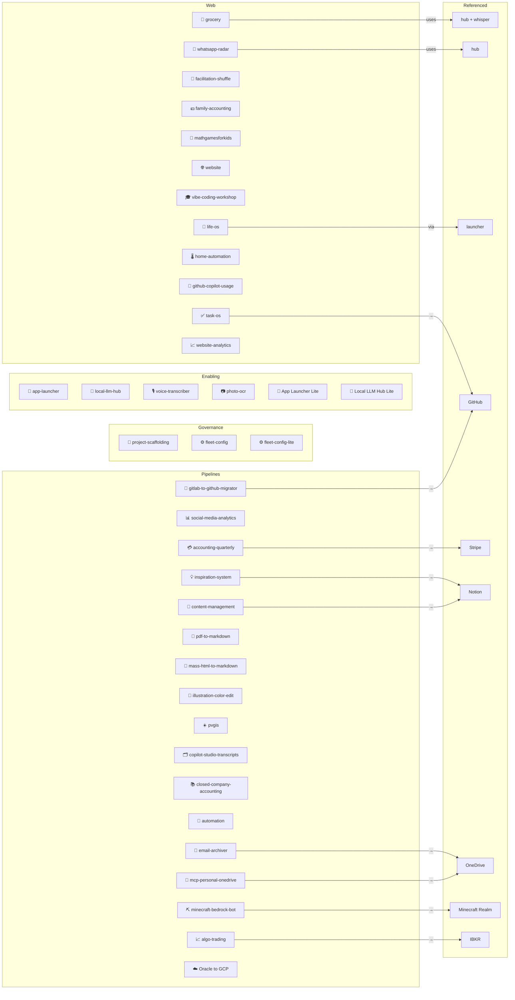

# Global instructions

One file, symlinked by `fleet-config/install.ps1` into every agent's user-scope context path — Claude Code (`~/.claude/CLAUDE.md`), Codex (`~/.codex/AGENTS.md`), Pi (`~/.pi/agent/AGENTS.md`), Copilot CLI (`~/.copilot/copilot-instructions.md`). Hooks, statusline, and tool settings are Claude-Code + Codex-only (matrix: `fleet-config`'s `docs/cross-agent-parity.md`). Agent-specific sections are marked *(… only — skip on other agents)*.

> **Here vs project.** This file owns the **universal** — true for every repo, including a one-off with no UI/tray/launcher. Shape-specific guidance (Streamlit, tray/daemon, e2e UI testing, GitHub-Actions CI, restart recipes) lives in `project-scaffolding`'s `CLAUDE.md`. Test: *"would this still apply to a bare repo with no app?"* Yes → here, no → the scaffold, never both. (`ferraroroberto/project-scaffolding#68`; `/context-audit` enforces weekly.)

## Working method

### Plan mode is the default

Every non-trivial request starts in plan mode — non-trivial = anything beyond a one-line fix, a typo, or a question answerable without touching code. In plan mode:

- Do NOT edit files, run destructive commands, or commit anything.
- Investigate as needed (read files, search, run read-only commands).
- Resolve ambiguity through questions *before* proposing a plan; present it only when confident it reflects what the user wants.
- Stay in plan mode across rejections — revise and re-present; don't bail out to execution.

Recommended project setting: `{ "permissions": { "defaultMode": "plan" } }`. Exit plan mode only after explicit approval; approval transitions straight to execution in the same turn.

### Ask before assuming

Ask whenever a decision is expensive to undo or genuinely ambiguous. One sharp question beats three filler ones; use multi-choice (2–4 options) when the choice space is bounded. If multiple reasonable approaches exist, present them as options with tradeoffs — don't pick silently.

Always ask before assuming: file/module location for new code; data shape or schema; data source; error and empty-state handling; whether to add tests, and at what level.

Don't ask about things determinable from the code, things already specified, or meta-questions like "is the plan ready?" — that's what plan approval is for.

### Before editing

- Re-read any file before modifying it; for files >500 LOC, read in chunks.
- When renaming a symbol, search separately for: direct calls, type references, string literals, dynamic imports, re-exports, and tests.
- Reproduce before fixing: for any non-trivial bug, write a repro (script, failing test, or documented sequence) before the fix.
- Re-verify the issue's premise: confirm the symptom still reproduces and the code matches the issue before starting.
- `git log -- <file>` the area first — prior attempts at the same fix are the cheapest source of truth.

### While fixing

- Empirical proof for retry/timeout/backoff logic — verify the API-semantics assumption with a 10-line probe before shipping.
- Distinct error messages for distinct conditions ("down" vs "in flight past timeout").
- Don't bundle independently-revertable bugs in one PR — if bug-A's commit can revert without breaking bug-B's fix, ship two PRs.
- Leave info-level log breadcrumbs after a hard bug, in the same commit as the fix — the next occurrence should be diagnosable from logs.
- Test-plan checkboxes are observed, not aspirational: `[x]` means "I ran this and saw it pass."

### Execution: scope up front, then carry it through

- Front-load the questions — settle scope, ambiguity, and hard-to-undo decisions before starting.
- Once scope is agreed, execute end-to-end to a verified, shippable state. No per-phase approval; "large" is not "stop".
- Checkpoint on risk, not size: pause mid-task only for a real ambiguity, an unforeseen decision, or a finding that contradicts the plan.

### Chaining connected work

- After finishing and verifying a unit, check the related open issues; if the next step is a natural continuation, state it and proceed — new branch off freshly-merged `main`. Pause for approval only when it's risky, ambiguous, or materially bigger than discussed.
- One branch per coherent unit; keep commits and branches separable so any piece reviews and reverts on its own.

### Verify before declaring done

Verify every unit with the project's actual tooling (byte-compile, lint, tests). No checker exists → say so explicitly; never claim "tests pass" where there are no tests. Report failures faithfully with the output; never report done on a skipped step.

A passing suite proves the code behaves as written — not that the reported symptom is gone, nor that the fix is live in the deployed process. Before declaring done, re-run the original repro against that actual process and watch it pass. A regression test must first be proven to fail against pre-fix code (`git stash`), or its later pass means nothing. Deploy-coverage (`project-scaffolding#199`, `fleet-config#459`) confirms the fix shipped; the repro confirms it fixed what was reported.

If the repo declares a restart/refresh recipe for a long-lived local process, use it after code changes so the verified change is actually live (unless the user opted out). Don't ask a second permission just because the recipe restarts something — the local `CLAUDE.md` owns the command, scope, and build-identity check. No recipe, or the recipe says confirm first → stop and say exactly what's missing; never improvise process kills.

Any check, gate, health probe, or classifier that can fail to establish a fact must report that as its own state — `unknown` / `not confirmed` — never folded into the passing state. A null, a stale cache, an unresolved probe is not "fine"; a write acknowledged is not an outcome confirmed. Applies to health checks, verification gates, deploy-coverage checks, and delivery/status classifiers alike.

### Senior-dev check

Before finishing, ask: "What would a senior, perfectionist dev reject in review?" Fix duplicated state, inconsistent patterns, or broken architecture *within the file you're already editing* — don't expand scope to unrelated files.

## Conventions

- **Read the README first.** Don't assume `/app/`, `/src/`, `launch_app.bat`, or any path exists — layout is documented per project.
- **Web-app UI work consults the fleet design system:** `~/.claude/design.md` (light) + `~/.claude/design.dark.md` (dark) — colors, typography, spacing, and the navigation contract (floating bottom-tab pill). `/design-sync` reports drift. Streamlit POC spikes exempt.
- **Config & secrets:** project config in `config.json` or similar; secrets always in `.env`, never committed (`.env` is the env file; `.venv` is the venv directory).
- **Virtual environment:** use the existing `.venv`. Never create `venv`. Never activate — invoke via `& .\.venv\Scripts\python.exe ...` on Windows, `./.venv/bin/python ...` on POSIX.
- **Logging:** the language's logging facility (Python: `logging`, not `print()`). Emojis welcome: ℹ️ ⚠️ ❌ ✅
- **Naming:** snake_case files/functions (Python), PascalCase classes, UPPER_CASE constants. **Imports:** stdlib → third-party → local.
- **Versioning:** follow the file's existing style — `==` where it pins, `>=` where it lower-bounds. Don't change the policy unless asked.
- **Type hints** on all public Python functions; `Optional[T]`, never bare `None` returns.
- **No hardcoded paths or credentials.**
- Implement only what was asked. No nice-to-haves.
- Three similar lines beats a premature abstraction — add a helper on the third caller, not the second; don't wrap framework scaffolds on day one.

## Workflow defaults

### Commit messages — no AI attribution

Never add `Co-Authored-By: Claude …`, `Co-Authored-By: Codex …`, or any AI/Anthropic/OpenAI attribution trailer (the user explicitly rejected this). Conventional `type: subject` line + bullet body only.

### Git discipline

Never auto-commit or push, and never stage files, without being asked — prepare a ready-to-copy commit message; the user runs it. Conventional prefixes (`feat:` `fix:` `refactor:` `docs:` `chore:` `test:` `perf:`). Multi-line body: first line ≤72 chars, blank line, then bullets explaining *why* not *what*.

### Branch & PR pipeline

`main` is always shippable. One issue → one branch → one PR → merge → branch deleted, issue closed.

Branch naming: `<type>/<issue-N>-<short-slug>` — e.g. `fix/28-terminal-reconnect`, `feat/30-osc-title`. Type matches the commit prefix.

**Lifecycle:** branch off latest `main` → first push opens the PR as **draft** with the issue's acceptance checklist → promote to ready when checks pass → squash-merge + auto-delete branch → `git checkout main && git pull && git branch -d <branch>`, `git fetch --prune`, confirm the issue auto-closed. (Some sister projects use a local-merge flow — follow the project's own pipeline where it differs.)

**Hard rules:** never commit to `main` directly — the one sanctioned exception is the **`/quick` skill** (below-issue-threshold trunk commit; explicit invocation is the authorization, and its SKILL.md owns the size caps, mandatory verification, and escalate-to-issue rule); never force-push a branch someone else or CI might have pulled; never stack a second feature branch on an unmerged first; one feature/fix per branch — an unrelated mid-branch bug gets its own issue and branch. **Never stack hotfixes on hotfixes** — a fix exposing a new bug means revert before adding a third change; three same-day PRs interacting badly means roll back to last known-good and re-introduce one at a time.

**PR body:** single-commit PR → `Summary` + `Test plan` checklist + `Closes #N`. Multi-commit → per-commit table (`SHA | What | Why`) + `Closed in this PR` + `Still open`. A **cumulative branch** is the exception, allowed only for rapid verified-per-commit rounds — document the policy in the PR body and default back to one-issue-one-branch when the round closes.

**Concurrent same-repo work:** first come, first owns `main` — later sessions build in an isolated `git worktree` (`<repo>-wt-<N>`, venv junctioned) on their own branch. The `issue-*` skills automate this via `fleet-config`'s `skills/_lib/worktree_claim.py`; mechanics + the junction-teardown footgun are in that repo's `docs/skills.md` ("Concurrent same-repo work").

### Planning & documentation

**Plans, roadmaps, proposed features live as GitHub issues**, never as files in the tree. One issue per topic, self-contained enough to hand off cold (executable by a fresh LLM/human with zero session context). The issue + closing PR + `git log` *are* the changelog — no dated `docs/YYYY-MM-DD-*.md` retrospectives.

- **One canonical issue per decision-bearing topic** — reproduce durable content, don't depend on links; other repos get one-line pointer issues.
- **Decision log:** dated distilled bullets inside long-lived issues recording why the plan turned.
- **Supersede explicitly:** comment on the old issue linking the new, then close it — never silently diverge.

**`gh issue create` defaults:** always `--assignee @me` + at least one type label (`bug`, `enhancement`, `refactor`, `docs`, `chore`, `test`, `perf`; `meta` for cumulative/rollback context). Create the label first if missing.

**Issue body format:** owned by the `/issue-add` skill (its step 6 is the one canonical template — title style, section list, `file:line` grounding). Filing without invoking that skill? Use it anyway rather than improvising a section list here.

**Decompose:** can't be one PR → "Step N/M" sub-issues, each independently shippable; no "phase 1 of 4" PRs. **Cross-repo:** a shared-pattern bug gets the same issue in each affected repo, cross-linked by URL. **Closing:** `Closes #N` in the PR body; direct-commit closes paste the SHA in a comment; not-planned closes explain the disproof — no zombie issues. **On rollback:** file a `meta` issue capturing what was attempted, what worked/didn't, a checkbox list of what's still open, and the rollback + base-of-truth SHAs.

**`docs/` is for durable reference** a future reader will re-open (design records, architecture overviews, integration guides, shared playbooks). Topic filenames, never dates. Never plans/TODOs (→ issues) or dated changelogs.

**Feature work:** update `README.md` if usage, config, or output changed; add `docs/<topic>.md` only for a durable concept. One-line fixes: just commit. **Rotation/expiration dates go in README, not memory** — certs, tokens, deprecations get a calendar-anchored README line.

### Markdown that will be rendered — no hard wraps

Markdown headed for a renderer (GitHub issue/PR bodies, comments, Notion via MCP) must **not** hard-wrap paragraphs at 70/80 cols — paragraphs are single long lines; newlines only between paragraphs, between list items, and inside code fences. (The user reads on a vertical terminal where forced breaks fight natural wrapping.) Does **not** apply to: source code, plain repo `.md` read as source, commit messages (wrap at 72), terminal-only output.

### Issue workflow skills

Three global skills automate the GitHub-issue workflow in every sister project, from one `fleet-config/skills` source junctioned into each agent's auto-scanned skills dir (`~/.claude/skills` Claude; `~/.agents/skills` Codex + Pi; `~/.copilot/skills` Copilot) — same `SKILL.md` format everywhere, no translation. Antigravity has no user-skills dir (plugin-only): documented non-goal (#160).

- **`/issue-add`** — rough idea/transcript → one researched, well-formed, labelled, self-assigned issue. Creates directly, no checkpoint.
- **`/issue-start`** — pick issue, sync `main`, cut branch, load context. Mode from the type label: `bug`/`chore`/`documentation` → fast (build straight away); `enhancement` → plan gate. Override: `now` / `plan`.
- **`/issue-finish`** — confirm acceptance, update README, verification gate, push, PR with `Closes #N`, CI, auto-merge + delete branch, land on main, safe tray restart. No dated changelog files.

All stay generic and read each project's CLAUDE.md for the gate command, ports, and tray procedure.

### Spawning sub-agents — cap concurrent Opus at 3 *(Claude Code only — skip on other agents)*

Keep at most **3 background Opus sub-agents in flight** (sliding window: dispatch up to 3, refill as each returns). **Sonnet sub-agents are exempt** — they fan out freely and don't count against the window. Works around Anthropic's Opus-specific server-side burst limiter, which rate-limits the 4th–5th+ concurrent bootstrap (anthropics/claude-code#53922, https://code.claude.com/docs/en/errors). It is **not** `CLAUDE_CODE_MAX_TOOL_USE_CONCURRENCY` (that bounds parallel tool calls in one session, not sub-agents) — the only place to cap sub-agent count is the orchestrating skill's dispatch logic. Tier vocabulary and per-host model mapping live in `fleet-config/docs/model-tiers.md` (single source — don't restate a tier table).

**A sub-agent does not self-resume when its own background task finishes** — only the top-level session gets that wake-up, so one that backgrounds a step and ends its turn with "I'll wait for it to finish" just stops (`project-scaffolding#124`). Brief any sub-agent running a long background step up front: it will not be auto-woken — it must poll (`BashOutput`/`Monitor`) to completion *within its own turn* before ending.

**A headless top-level `claude -p` session has no wake-up mechanism at all** — backgrounding-and-waiting there is fatal, not just stalled: the CLI exits on the clean turn-end and reports `exit_code: 0`, false success over a skill that never ran (`fleet-config#314`). Every scheduled fleet skill runs this way — its own `run-weekly.bat` calling `claude -p "/<skill>" ... --permission-mode bypassPermissions`, no human attending, no orchestrator to resume it. Any command inside a skill meant for unattended/scheduled execution must run synchronously (foreground) or poll to completion within the same turn; never fire-and-forget a tool call and end the turn expecting to be resumed.

### Project hygiene

- Restart the minimum. Multi-process projects document a one-line restart matrix in README (touched X → restart Y); restarting more loses warm state and breaks siblings. A scope guard, not an opt-out from the repo-declared safe restart.
- Pinned known-good worktree for risky/architectural work — a parallel checkout at the last known-good commit for live A/B; don't touch it until the risky work re-stabilizes.

## Project fleet

### `project-scaffolding` is the canonical master

`E:\automation\project-scaffolding` (`ferraroroberto/project-scaffolding`) is the scaffold repo whose `CLAUDE.md` sister projects derive theirs from; its `docs/playwright-ui-testing.md` is the shared e2e-testing reference. Its pipeline: branch off `main` → push → **draft PR** → promote → **squash-merge + delete branch**; branch `<type>/<issue-N>-<slug>`; issues need `--assignee @me` + a type label.

### Propagate generalizable conventions up to scaffolding

Sister-project work producing a *generalizable convention* (testing pattern, CLAUDE.md rule, workflow) routes up to `project-scaffolding` so every project inherits it — ad-hoc per-project divergence was explicitly rejected.

- Per-project *instances* (real script names, paths) stay in the project's own CLAUDE.md; the reusable *concept* goes to scaffolding.
- Check for an existing `project-scaffolding` issue first; otherwise file one (master's template + label + `--assignee @me`).
- If asked, draft the master change on a proper branch via its draft-PR pipeline, one issue per branch.

### Every repo carries a `.fleet.toml`

Each fleet repo declares its architecture-map card in a root `.fleet.toml` (`layer` ∈ governance | enabling | working-web | working-pipe, `icon`, `description`; optional `display_name` / `port` / `chips` / `tag`). `/system-map` aggregates these into the map; `architecture/fleet.residual.json` is only the fallback for non-adopters plus non-repo structure, so a new repo appears with no central edit. (Schema: `fleet-config/architecture/README.md`; decision `ferraroroberto/fleet-config#148`.)

**Anti-staleness contract:** update `.fleet.toml` in the **same PR** as any material change (port, layer, role, description, exposed services). `fleet-config`'s drift test fails loud if an adopted repo loses its file; `project-scaffolding` ships one so every clone inherits the convention.

<!-- system-map:mermaid:start -->
### Fleet map

Text-native picture of the fleet's repos and how they relate — regenerated by `/system-map` from the same `fleet.data.js` the PNG map reads; icons + names only, no descriptions (kept lean for every-session context cost). Edges come from each repo's `.fleet.toml` `tag` field.


<!-- system-map:mermaid:end -->

## Local infrastructure

### `local-llm-hub` local LLM hub

`E:\automation\local-llm-hub` runs a FastAPI hub on `127.0.0.1:8000` exposing Anthropic-shape `POST /v1/messages` and OpenAI-shape `POST /v1/chat/completions`, routed by `model` name: Claude/Gemini ids reach the local CLI on the user's subscription, open-weight ids reach llama-server backends on their own ports. **Live model ids and ports: that repo's README + `docs/model-comparison.md`, or `GET /v1/models`** — a latest-only policy replaces entries when newer models ship, so never trust a copied list (this one went stale twice).

Whisper-server at `127.0.0.1:8090` (`ggml-large-v3-turbo.bin`, OpenAI-compatible `/v1/audio/transcriptions`). The hub also proxies audio on `:8000` (`/v1/audio/transcriptions` + `/v1/audio/translations`) so requests land in the observability ring; direct `:8090` POSTs are lower-overhead but invisible to the admin UI. Port 8090 is mutex-shared with `automation/audio/transcribe_voice`.

**Calling it:**

```python
from anthropic import Anthropic
client = Anthropic(api_key="local-dummy", base_url="http://127.0.0.1:8000")
client.messages.create(model="claude-haiku-4-5", ...)
```

```bash
curl -F file=@clip.wav http://127.0.0.1:8090/v1/audio/transcriptions
```

**Limitations:** image/document content blocks work on the subscription paths, but only via the Anthropic `/v1/messages` shape (base64-decoded to a per-request temp dir, fed via `--add-dir`); llama-server backends are text-only and 400 on image input. Also: OpenAI-shape → claude silently drops `image_url` parts; URL image sources are passed as a text reference, not fetched; extended-thinking blocks are dropped at the shape boundary; no streaming on `/v1/messages`; Anthropic-shape tool-use to the open-weight backends is unimplemented (OpenAI-shape works via `--jinja`).

### Don't duplicate hub functionality in downstream apps

Route downstream Claude/local-LLM access through the hub via standard SDKs — never re-implement inline `claude -p` subprocess wrappers (rejected as duplicated engineering; the hub owns subprocess management, prompt assembly, multi-turn flattening, host-routing, and observability).

- LLM call → `Anthropic(api_key="local-dummy", base_url="http://127.0.0.1:8000")` or `OpenAI(api_key="local-dummy", base_url="http://127.0.0.1:8000/v1")`.
- Audio → POST directly to `http://127.0.0.1:8090/v1/audio/transcriptions`.
- Hub lacks a feature → write a plan for `local-llm-hub` to add it; don't bypass the hub.

### Prefer scripts over session-injected MCP connectors for automation

For unattended/automation workflows, prefer a thin Python script (standard SDK or REST) over a session-injected MCP connector — a fleet audit (`ferraroroberto/fleet-config#128`, 945 transcripts) found 97% of injected tool surface unused. Every enabled connector is a fleet-wide, every-session context cost.

- New automation → script via SDK/REST first; connectors only for genuinely interactive, exploratory, one-off use.
- Keep the default connector set minimal; toggle one on per session that needs it.
- A connector that becomes a recurring automation dependency is the signal to scriptify it and disable the connector by default.

## Recurring gotchas

### Git Bash strips backslashes in `settings.json` commands *(Claude Code only — skip on other agents)*

Claude Code on this machine executes `settings.json` commands (statusLine, hooks) through **Git Bash**, which treats `\` as an escape — Windows paths in command strings must use **forward slashes** (`C:/Windows/...`) or they silently mangle (`C:\Windows` → `C:Windows`). Codex invokes the Python hook modules directly (no Git Bash, no `run-hook.ps1` shim). Working command form:

```
C:/Windows/System32/WindowsPowerShell/v1.0/powershell.exe -NoProfile -NonInteractive -ExecutionPolicy Bypass -File C:/Users/rober/.claude/<script>.ps1
```

### Windows PowerShell in spawned commands (any agent)

- **Avoid `pwsh`** in spawned commands — the PATH `pwsh` is a 0-byte WindowsApps reparse stub that fails non-interactively. Use the absolute path `C:/Windows/System32/WindowsPowerShell/v1.0/powershell.exe`.
- **Never call native `cmd.exe /c` from Git Bash.** MSYS rewrites the single-slash switch to `C:/`, so cmd opens interactively and never runs the requested command (fleet-config#385). Use the PowerShell tool/absolute `powershell.exe` path; if Bash must call cmd, the MSYS-safe spelling is `cmd.exe //c`.
- **PowerShell scripts reading the agent's stdin JSON** use `[Console]::In.ReadToEnd()` — `$input` is unreliable across the shell → powershell.exe pipe.
- `[math]::Round(x) + '%'` parses as arithmetic and throws — cast first: `[string][math]::Round(x) + '%'`.

### PYTHONPATH for out-of-tree Python scripts

Invoking `& .\.venv\Scripts\python.exe <script-outside-project>` that imports project packages fails with `ModuleNotFoundError` — Python sets `sys.path[0]` to the *script's* dir, not CWD, so `cd`-ing in doesn't help. Prepend `$env:PYTHONPATH = (Get-Location).Path;` (Windows) / `PYTHONPATH=$(pwd)` (POSIX). Better when the script can live in-tree (gitignored scratch is fine): `& .\.venv\Scripts\python.exe -m <module.path>` from the repo root — `-m` adds CWD to `sys.path`, no env var.

### Windows Python: UTF-8 stdout under capture

Piped/redirected stdout makes Python fall back to cp1252, so emoji/box-drawing `print()` throws `UnicodeEncodeError` and exits 1 — even though it works in a real terminal. Set `$env:PYTHONUTF8 = "1"` under capture; durable code fix: `sys.stdout.reconfigure(encoding="utf-8")` (and stderr) at entry points.

**The inverse, in any process that sets `PYTHONUTF8`:** `subprocess.run(..., text=True)` decodes the *child's* output as UTF-8, but native Windows console tools (`schtasks`, `netsh`, `sc`, `tasklist`, `wmic`, `reg`, `ipconfig`, …) emit the OEM code page (cp850 here), which is not valid UTF-8. It doesn't raise — `proc.stdout` comes back empty/`None`, so any `if not proc.stdout: return None`-shaped guard reads it as "the query failed" and the feature degrades silently. Every such call site must pin its own decoding — `encoding="oem", errors="replace"` — never inherit `text=True`'s ambient locale (`replace` so one odd byte costs a character, not the whole feature). It reproduces only *inside* the app: from any terminal there is no `PYTHONUTF8`, so identical code returns the full output and looks healthy (`app-launcher#743`).

**Corollary:** a helper that returns `None` on failure must **log** the failure — a dead query is otherwise indistinguishable from a quiet system. Same "an unestablished fact needs its own visible state" rule the health checks already follow.

### Browser automation must not look like a bot

Every Playwright / automated-browser launch must present as a real human Chrome session (past captchas on detection; social platforms risk account lockouts):

- Strip the automation infobar: `ignore_default_args=["--enable-automation", "--enable-blink-features=IdleDetection"]`.
- `navigator.webdriver` must read `undefined` — `add_init_script` with `Object.defineProperty(navigator, 'webdriver', {get: () => undefined});` (not just a CLI flag).
- Real Chrome (`channel="chrome"`), not bundled Chromium.
- Persistent profile, viewport 1280×900, `--disable-blink-features=AutomationControlled`.
- Also `--disable-features=Translate`, `--no-default-browser-check`, `--no-first-run`.
- `chromium_sandbox=True` on `launch` / `launch_persistent_context` — Playwright's default (`False`) injects `--no-sandbox`, which pops Chrome's *"the `--no-sandbox` flag you are using is not supported"* infobar, itself a bot tell. `True` enables the sandbox and drops the flag.

**Single source per project:** launch kwargs + init-script live in one helper (e.g. `config/chrome_launch.py`, `automation/browser.py`); every module imports it — never re-inline launch args. If the user reports a captcha or "unusual activity", suspect a stealth regression first.

### Shared Chrome profiles: serialize access, never kill a live holder

A persistent Chrome profile allows one live instance; a second launch gets Playwright's *"Opening in existing browser session"* and dies. Never "self-heal" by killing the holder — it's usually a legitimately-running sibling job. **Wait** with exponential backoff (60→120→240→480 s), re-attempting each cycle; raise a precise error only after the schedule (a >15-min holder is genuinely hung). On Windows the lock is a live-process kernel object, **not** the POSIX `SingletonLock`/`Cookie`/`Socket` files — deleting those does nothing. Put detect-holder + wait-with-backoff in one helper every session imports; never re-inline launch-with-retry.

### GitHub's `Closes #N` keyword matches on substrings, not standalone clauses

GitHub's issue-closing parser (`close(s|d)?` / `fix(es|ed)?` / `resolve(s|d)?` + `#N`) matches anywhere in the text, including mid-sentence — "Closes #355 findings for …" auto-closed a tracking issue mid-migration (`app-launcher#355`). When a PR advances one finding of a multi-PR issue without finishing it, avoid the keyword entirely — "Part of #N", "Addresses one of #N's findings", "Progresses #N" — and reserve the literal `Closes #N` / `Fixes #N` for the one PR that actually finishes the issue.

### Three clocks — normalise to UTC before correlating GitHub state with local logs

`gh` JSON timestamps (`closedAt`, `createdAt`, `mergedAt`) are **UTC**, suffixed `Z`. This host is **`+0200` in summer, `+0100` in winter** (Europe/Brussels — read the offset, never hardcode it). An app-launcher job log's `[h:mm:ss]` prefix is **elapsed since run start**, not a wall clock at all (`fleet-config`'s `skills/_lib/claude_progress.py:282`, off `time.monotonic`); only the `<run_id>` directory name is a local wall-clock stamp, so a line's real time is `run_id + elapsed`. Normalise everything to UTC *before* comparing, and state the conversion in the working notes — any conclusion resting on event ordering ("the gate saw it already closed", "the fix landed before the failure") is worth exactly as much as that arithmetic, and getting it wrong fails **silently**: a plausible, confidently-wrong story rather than an error. `fleet-config#633` was an entire fabricated defect issue built on reading `12:12Z` as local `12:12`.

**The same shape without clocks:** when a claim is "tool X reported the wrong thing at time T", reconstruct what X could *observe* at T. Re-running X now answers a different question and will cheerfully agree with you.

### Subprocess spawns must suppress the console window (Windows)

Any `subprocess.Popen`/`.run`/`.call`/`.check_output`/`.check_call` that launches an external executable (ffmpeg, ssh, docker, tailscale, nvidia-smi, clip, a helper script, …) must pass `creationflags=subprocess.CREATE_NO_WINDOW` on Windows — parents with no console of their own (pythonw, a tray app, a scheduled task, a daemon) otherwise get a console window flashed on screen for every spawn. Default to suppressing it; only omit the flag when the window is meant to be visible to the user (rare — e.g. a deliberately-opened interactive terminal). Prior instances: `local-llm-hub`#317/#282/#174/#169, `voice-transcriber`#147; gap audit `fleet-config`#399.

Canonical pattern (short-lived, no signaling needed):
```python
creationflags=subprocess.CREATE_NO_WINDOW if sys.platform == "win32" else 0
```
For a long-lived child that later needs `CTRL_BREAK_EVENT` or graceful termination, combine with a process group:
```python
if sys.platform == "win32":
    kwargs["creationflags"] = subprocess.CREATE_NEW_PROCESS_GROUP | subprocess.CREATE_NO_WINDOW
```
`DETACHED_PROCESS` and `CREATE_NO_WINDOW` are mutually exclusive — never combine them (see `local-llm-hub`#282). Repos with 3+ call sites should factor this into one `_no_window_flags()` / `NO_WINDOW` helper (see `local-llm-hub/scripts/_lib.py`, `whatsapp-radar/src/subprocess_flags.py`) rather than repeating the ternary at every call site.

### Windows ephemeral port exhaustion takes down the whole fleet at once

Symptom: **all** local web apps unresponsive at once (any subset of app-launcher/home-automation/whatsapp-radar/voice-transcriber/local-llm-hub), dead 1–4 min, self-heals with no restart, no code change. Simultaneity across independent processes is the tell — a shared kernel resource, not one app's diff. Cause: dynamic port range `49152–65535` (16,384 ports), `TcpTimedWaitDelay` unset → every closed outbound connection parks in `TIME_WAIT` ~120 s; a burst drains the range and **no process on the box can open an outbound socket** until it drains. (`fleet-config`#440, observed 2026-07-25/26.)

**Diagnose in one minute:**
```powershell
Get-WinEvent -FilterHashtable @{LogName='System'; ProviderName='Tcpip'} -MaxEvents 20 | Select TimeCreated, Id, Message
Get-NetTCPConnection | Group-Object State | Sort-Object Count -Descending
netsh int ipv4 show dynamicport tcp
```
Event IDs 4231 (TCP)/4266 (UDP) = "ephemeral port space ... all such ports being in use". Windows rate-limits these, so absence doesn't rule it out — corroborate with the `TIME_WAIT` count (a normal afternoon on this host oscillates ~325–800, routinely the top state in the table).

**Fix hierarchy — cheapest and most targeted first:**
1. Fix the leak: find and stop whatever opens short-lived outbound connections in a burst/loop (a poller with no backoff, retry-without-backoff, a health check with no session reuse).
2. Pool connections: module-level `requests.Session` (or equivalent), never a bare `requests.get`/`urlopen` per call inside a loop; back off a failing endpoint instead of retrying at full rate; never point an e2e suite at a live production app.
3. Last resort, machine-level, needs elevation + a reboot — **Roberto's call, never applied unattended by an agent:** `TcpTimedWaitDelay = 30` at `HKLM\SYSTEM\CurrentControlSet\Services\Tcpip\Parameters` (valid 30–300), ~4x effective capacity without touching the range. Microsoft-documented; re-measure its effect on the Windows 11 stack after applying, don't assume it.

**Never narrow the range downward** — `netsh int ipv4 set dynamicport tcp start=10000` (seen circulated, wrong) hands out this machine's 16 fixed listeners as ephemeral ports: cloudflared `20241-3`, tailscaled `40746`, OneDrive `42050`, MouseWithoutBorders `15100/1`, llama-server `18093`, StreamDeck `28196/8`, MSI services `26822/32683/33683`, logioptionsplus `19010`, hwinfo `10000` — turning a visible, self-healing outage into intermittent bind failures far harder to diagnose. Safe floor on this host if the range must widen: `netsh int ipv4 set dynamicport tcp start=44000 num=21535` (clears every observed fixed listener) — still machine-level tuning, still Roberto's call.
